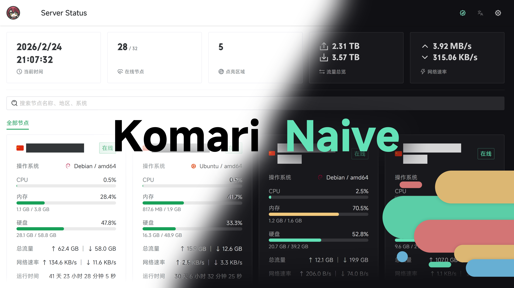

# 🌸 Komari Naive Extended

<p align="center">
  <a href="https://github.com/oKafuChino/komari-theme-navie-extended">
    
  </a>
</p>

基于 [lyimoexiao/komari-theme-naive](https://github.com/lyimoexiao/komari-theme-naive) 扩展的 Komari Monitor 主题。保留 Naive UI 的监控信息密度，并增加环境特效、Live2D、剩余价值计算和三网 TCP 延迟地图。

## ✨ 功能

- 卡片与列表双视图、分组、搜索、深浅色主题及大量后台显示配置。
- 低负载樱花飘落与鼠标星轨，支持触摸设备和减少动态效果偏好。
- 可选 Live2D 看板娘：固定于页面左下角，桌面跟随鼠标、触摸设备跟随按住的手指。
- 可选剩余价值计算器：按节点公开的价格、周期、币种和剩余天数估算价值。
- 三网 TCP 延迟：中国地图展示全国 31 个省级区域的移动、联通、电信 TCP 延迟；港澳台显示未测试。

## ✅ 环境要求

- Komari 1.2.6+

Komari 的 `/admin` 与 `/terminal` 使用系统内置界面；本主题负责公开监控页和节点详情页。

## 📦 发布包

每次构建会在本地 `release/` 目录生成两个 ZIP：

| 文件                                          | 用途                                           |
| --------------------------------------------- | ---------------------------------------------- |
| `komari-theme-naive-extended-build-<sha>.zip` | 主主题，上传并启用它。                         |
| `komari-live2d-model-pack-template.zip`       | 可选的独立 Live2D 模型资源模板，只需安装一次。 |

从 [Releases](https://github.com/oKafuChino/komari-theme-navie-extended/releases) 下载主主题 ZIP。发布者上传 GitHub Release 时，必须把主主题 ZIP 作为**第一个附件**；Komari 的仓库更新机制会下载最新 Release 的第一个附件。

## 🚀 安装与更新

1. 在 Komari 后台进入 `设置` → `主题管理`。
2. 上传 `komari-theme-naive-extended-build-<sha>.zip`。
3. 将 `Komari Naive Extended` 设为当前主题并刷新公开页面。
4. 后续更新主主题时仅上传新的主主题 ZIP；不会删除独立模型资源包中的模型。

## 🎭 Live2D 模型资源包

看板娘默认关闭。启用前先准备模型资源包：

1. 下载并解压 `komari-live2d-model-pack-template.zip`。
2. 将完整 Cubism 3/4 模型复制到 `dist/model/`，保持模型内部相对目录不变。
3. 重新压缩 ZIP 根目录中的 `dist/`、`komari-theme.json` 与 `preview.png`，不要增加额外父目录。
4. 在主题管理中上传该资源包。它的固定标识是 `komari-live2d-models`，请勿将它设为当前主题，也请勿删除。
5. 在主主题设置中开启 Live2D，并填写模型入口，例如 `/themes/komari-live2d-models/dist/model/model.model3.json`。嵌套模型目录同样可用。

Komari 通过原生静态路由 `/themes/:id/*path` 提供资源包文件，因此 Docker、面板、systemd 和反向代理部署不需要额外路径规则。主主题更新只替换 `NaiveExtended`，不会覆盖 `komari-live2d-models`。

模型资源包不含角色素材。只部署有权公开展示的模型；建议纹理不超过 `2048x2048`，移除不需要的动作和声音。Komari 读取静态模型文件时会产生与文件大小相关的单次瞬时内存占用，压缩包体积不等于浏览器解码后的纹理内存。

首次问候会由访客浏览器请求 `https://api64.ipify.org?format=json` 获取公网 IP。ipify 会接触该 IP；主题和 Komari 不会保存 IP，只在当前浏览器会话保存“已问候”和“已关闭”标记。模型或 IP 服务不可用不会影响监控页面。

## 💰 剩余价值计算器

管理员可在主题设置中开启计算器，并选择 `CNY`、`USD`、`EUR` 或 `GBP`。计算在访客浏览器中完成，使用 Komari 已公开的价格、计费周期、币种和剩余天数；按完整天数向下取整，不修改 Komari 后端。

访客首次打开抽屉时，浏览器会依次请求 jsDelivr 的 Currency API 和 Cloudflare Pages 镜像获取汇率；两者失败时才使用管理员设置的备用汇率。外部服务会接触访客 IP。有效汇率在本地缓存 12 小时，功能关闭或抽屉未打开时不会请求汇率。

## 🗺️ 三网 TCP 延迟

节点详情页提供“三网 TCP 延迟”标签。只有已登录管理员能开始测试；访客只读取管理员最近一次完整结果，不会创建任务、轮询或发起探测。

- 测试由目标 VPS 的 Komari Agent 发起，固定访问全国 31 个省级区域的移动、联通、电信 `*.ip.zstaticcdn.com:80` 地址，共 `93` 个目标。
- 每批最多创建 `12` 个临时 TCP 任务；任务创建后从第 2 秒开始每秒读取，最长等待 7 秒；无记录目标最多重试一轮。
- 每轮任务立即删除，管理员地图按批次预览；取消或保存失败会保留上一次访客可见快照。
- 地图按三家运营商的有效延迟平均值着色；详情始终按移动、联通、电信顺序显示，港澳台为未测试。

该功能复用 Komari 现有 PingTask、记录和主题设置能力，不修改 Komari 后端或 Agent，不新增服务、数据库表、定时任务或第三方依赖。“三网 TCP 延迟历史数据”由主题自动维护，请勿手动编辑。

## 🔒 隐私与安全

- 主题管理中的动态配置会通过 `/api/public` 公开，切勿在任何主题设置中填写 Token、密码、私密 URL 或其他敏感数据。
- 公告、备案和背景链接仅使用安全的站内或 HTTP(S) 地址；不安全地址会被忽略。
- Live2D 模型仅允许从本机 Komari 的独立资源包目录加载，模型内部引用也必须保持在同一模型目录内。

## 🧰 开发

```bash
pnpm install
pnpm dev
pnpm test:unit
pnpm type-check
pnpm lint
pnpm build
```

`pnpm build` 会执行类型检查、生产构建，并验证 `release/` 内两个 ZIP 的内容。可用 `pnpm preview` 预览生产构建。

## 📄 License

[MIT](./LICENSE)
